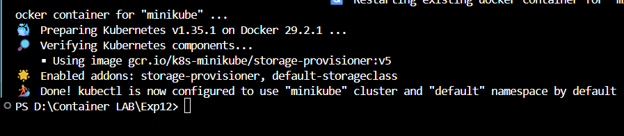
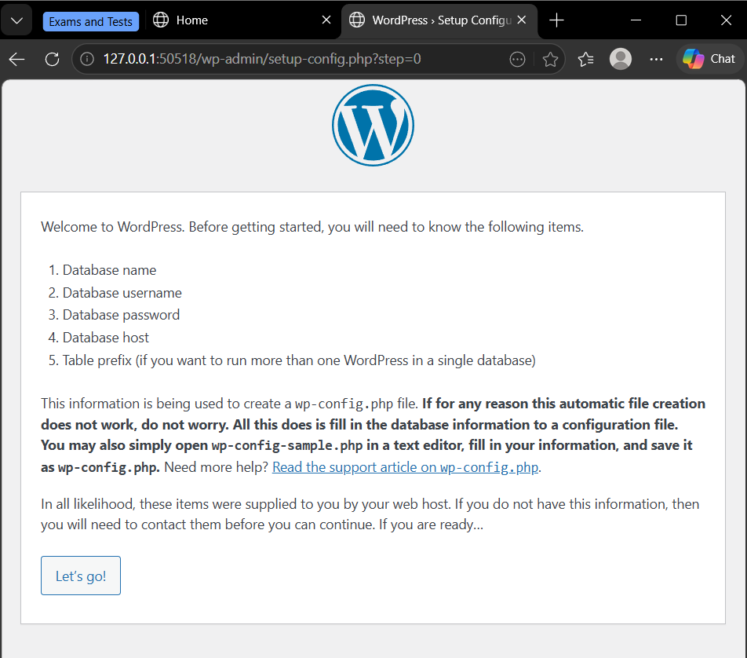

# Experiment 12: Kubernetes Deployment and Orchestration

**Name:** Varnika Singh  
**SAP ID:** 500120368  
**School:** School of Computer Science  
**University:** University of Petroleum and Energy Studies, Dehradun  

---

## Objective

Learn why Kubernetes is used, its basic concepts, and how to deploy, scale, and manage applications using Kubernetes commands.

---

## Why Kubernetes over Docker Swarm?

| Reason | Explanation |
|--------|-------------|
| Industry standard | Most companies use Kubernetes |
| Powerful scheduling | Automatically decides where to run your app |
| Large ecosystem | Many tools and plugins available |
| Cloud-native support | Works on AWS, Google Cloud, Azure |

---

## Core Kubernetes Concepts (Simple Explanation)

| Docker Concept | Kubernetes Equivalent | What it means |
|---------------|----------------------|----------------|
| Container | Pod | A pod is a group of one or more containers. Smallest unit in Kubernetes |
| Compose service | Deployment | Describes how your app should run |
| Load balancing | Service | Exposes your app to the outside world |
| Scaling | ReplicaSet | Ensures required number of pod copies are running |

---

## Hands-On Lab (Using Minikube / k3d)

> Make sure `kubectl` and a cluster are already installed.

### Starting Minikube



**Minikube IP:**


---

## PART A – Core Tasks

### Task 1: Create a Deployment

A deployment defines:
- Container image  
- Number of replicas  
- Labels for pods  

**Deployment YAML File:**


**Apply:**

```bash
kubectl apply -f wordpress-deployment.yaml
```

**Deployment Created:**


---

### Task 2: Expose Deployment as Service

**Service YAML File:**


**Apply WordPress Service:**

```bash
kubectl apply -f wordpress-service.yaml
```

**Service Created:**


---

### Task 3: Verify Everything

```bash
kubectl get pods
kubectl get svc
```

**List of Pods:**


**List of Services:**


---

### Task 4: Access Application

Open the app in your browser using the NodePort:

```
http://localhost:30007
```

**Application Running:**



**Minikube Dashboard:**


---

### Task 5: Scale Deployment

Run the following commands to scale up the deployment:

```bash
kubectl scale deployment wordpress --replicas=4
kubectl get pods
```

**Scaling Command:**


**Pods After Scaling (4 Replicas):**


Now 4 pods will be running instead of the initial 2.

---

### Task 6: Self-Healing

Run the following commands to demonstrate Kubernetes self-healing:

```bash
kubectl get pods
kubectl delete pod <pod-name>
kubectl get pods
```

**Delete Pod Command:**


**Pods After Deletion (Auto-Recreation):**


Deleted pod is automatically recreated by Kubernetes to maintain the desired replica count.

---

## Key Takeaways

1. **Deployment:** Defines how your application should run
2. **Service:** Exposes your application to the outside world
3. **Scaling:** Easy horizontal scaling with `kubectl scale`
4. **Self-Healing:** Kubernetes automatically restarts failed pods
5. **Dashboard:** Visual way to monitor your cluster and resources

---

## Conclusion

This experiment demonstrates the core capabilities of Kubernetes:
- Creating and managing deployments
- Exposing applications as services
- Scaling applications based on demand
- Self-healing and automatic pod recreation
- Monitoring through the Minikube dashboard

Kubernetes provides powerful orchestration capabilities that make managing containerized applications at scale much easier than Docker Swarm.
